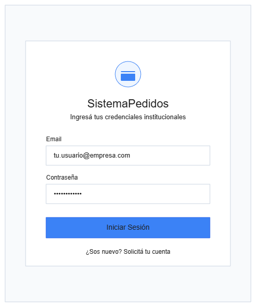
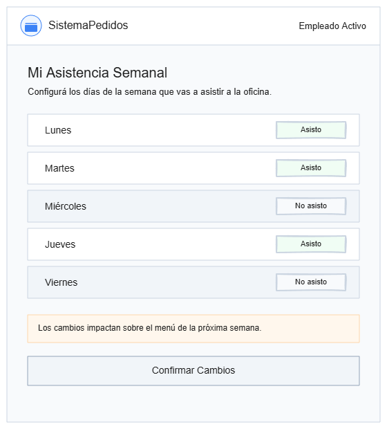
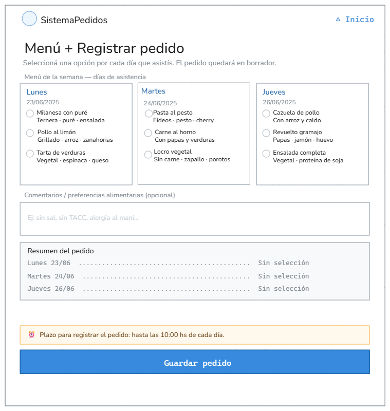
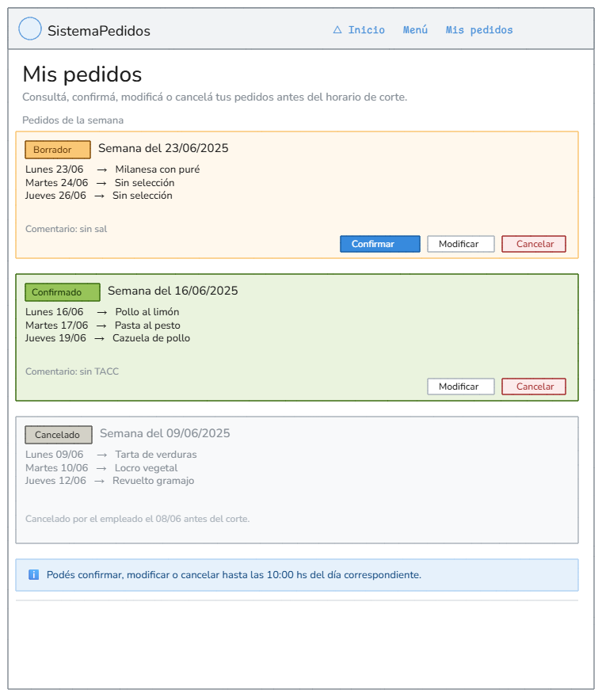
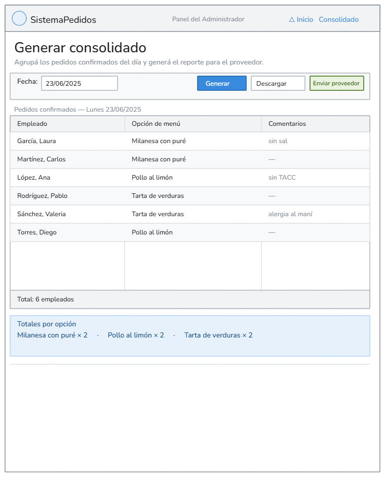

# Entrega 2 — Diseño de Interfaces
**Grupo**: Grupo-5
**Proyecto**: SistemaPedidos
**Fecha de entrega**: 25/06/2026
---
## 1. Inventario de pantallas troncales
| N° | Nombre | Actor principal | CU(s) cubierto(s) | Función (1 frase) |
|----|--------|------------------|---------------------|--------------------|
| 01 |	Login / Registro |	Empleado / Administrador |	— |	Permite al usuario autenticarse o registrarse en el sistema para acceder a sus funciones según su rol.|
| 02 |	Configurar asistencia |	Empleado |	CU-01 |	Permite al empleado seleccionar los días de la semana que asistirá a la oficina para habilitar sus viandas.|
| 03 | Menú + Registrar pedido |	Empleado |	CU-02 CU-03 |	Permite visualizar el menú del día y registrar el pedido de almuerzo con comentarios antes de confirmarlo.|
| 04 |	Mis pedidos |	Empleado |	CU-05 CU-06 CU-07 |	Permite al empleado consultar, modificar o cancelar sus pedidos activos antes del horario de corte.|
| 05 | Generar consolidado |	Administrador |	CU-10 |	Permite al administrador agrupar los pedidos del día por opción de menú y enviar el reporte final al proveedor.|
---
## 2. Trazabilidad pantalla ↔ E1
| Pantalla | CU(s) | HU(s) | Actor |
|----------|-------|-------|-------|
| 01 — Login / Registro | — | — | Empleado / Administrador |
| 02 — Configurar asistencia | CU-01 | HU-01, HU-10 | Empleado |
| 03 — Menú + Registrar pedido | CU-02, CU-03 | HU-02, HU-03, HU-06 | Empleado |
| 04 — Mis pedidos | CU-05, CU-06, CU-07 | HU-04, HU-05 | Empleado |
| 05 — Generar consolidado | CU-10 | HU-08 | Administrador |
---
## 3. Decisiones técnicas y observaciones
> Documentar acá las decisiones de diseño y desarrollo del grupo, organizadas por
pantalla.
> Esta sección es clave para la defensa oral del 25/06.
### Pantalla 01 — Login

### Pantalla 02 — Mi Asistencia Semanal

1- Para el layout elegimos una columna única donde cada día ocupa su propia 
fila con el nombre a la izquierda y los botones "Asisto" / "No asisto" a la 
derecha. Lo elegimos así porque hace muy fácil ver de un vistazo qué días 
vas y cuáles no, sin tener que buscar nada.

2- Agregamos una nota de aviso abajo de los días que dice "Los cambios 
impactan sobre el menú de la próxima semana", para que el empleado entienda 
por qué esta pantalla importa antes de confirmar.

3- Dejamos afuera los atajos rápidos ("Presencial 100%", "Híbrido típico"), 
el historial de configuraciones previas y la sección de observaciones. 
Preferimos arrancar simple y no sobrecargar la pantalla — si hace falta, 
se pueden agregar después.

4- Cubre el CU-01 — "Configurar asistencia semanal", que corresponde a 
la HU-01 del Empleado.
### Pantalla 03 — Menú + Registrar Pedido

1- Usamos Grid para los 3 días del menú (una columna por día) 
porque así se comparan fácil las opciones de cada jornada. 
El resto de la pantalla queda en una sola columna: comentarios, 
resumen y botón, de arriba a abajo.

2- Agregamos el campo de comentarios/preferencias alimentarias 
para que el empleado pueda indicar restricciones como alergias 
o dieta, y un aviso del plazo de corte (10:00 hs) para que 
sepa hasta cuándo puede pedir.

3- Dejamos afuera el indicador de stock y el precio por opción 
porque esa información depende de lógica del backend que todavía 
no tenemos — lo dejamos para el Bloque 3.

4- Cubre dos casos de uso: CU-02 "Consultar menú semanal" 
y CU-03 "Registrar pedido del día". El de registrar incluye 
al de consultar (<<include>>), por eso van en la misma pantalla.

5- El botón dice "Guardar pedido" y no "Confirmar" porque en 
nuestro modelo el pedido queda en estado Borrador al guardarse. 
La confirmación definitiva es un paso aparte (CU-13). 
Así el empleado puede revisar su selección antes de confirmar.

### Pantalla 04 — Mis pedidos

### Pantalla 05 — Consolidado
